# Forward Deployed AI Engineering — Capstone Master Plan
## Intelligent Support Routing, Retrieval, Generation & Governance System for CloudServe Solutions

---

### Executive Overview & Strategic Diagnosis

CloudServe Solutions asked for a **chatbot**. However, client discovery and dataset analysis demonstrate that building a generic conversational bot would fail to solve their crisis.

#### The Real Situation at CloudServe
* **Volume & Growth**: 500+ tickets/week across 4 channels (Email, Live Chat, Docs Comments, Community Forum) handled by only 6 agents.
* **SLA Breaches**: 8–12 hours average response time versus a 2-hour contractual SLA.
* **Low First Contact Resolution (FCR)**: 43.8% baseline FCR; 56.2% of tickets bounce to Tier 2 escalations, costing 4× more and causing severe customer friction.
* **Customer Satisfaction**: CSAT has plunged to 2.97 / 5.0 (contract renewals at risk).
* **The Root Bottleneck**: **71.4% of incoming tickets (357/500) are already answered in CloudServe's 29 knowledge base articles.** Agents cannot locate them due to title/keyword search mismatch (e.g., user asks *"my deployment keeps dying"*, article is titled *"resolving container health check failures"*). Agents rely on outdated personal snippet files, while Tier 1 forwards escalations with zero context.
* **The Safety Redline**: 17.4% of tickets (87/500) involve security incidents, compliance requests, or billing disputes (`must_not_auto_respond = True`), where an automated hallucination or unauthorized financial commitment would cause catastrophic customer and legal harm.

#### The Solution: A Forward-Deployed Support Automation & Context System
Rather than an ungrounded chatbot, we will engineer an **auditable, deterministic, multi-channel support pipeline**:
1. **Normalizes** multi-channel inputs into a unified representation.
2. **Classifies** intent (22 classes) and urgency with calibrated confidence.
3. **Retrieves** authoritative passages from CloudServe's documentation using dense vector semantic search.
4. **Routes** deterministically: Auto-responds only when confidence $\ge$ threshold AND documentation grounds the answer AND no safety redlines are triggered.
5. **Generates** cited responses strictly bounded to retrieved documentation.
6. **Enforces Hard Guardrails**: Blocks PII, hallucinations, tone violations, and prompt injections.
7. **Empowers Escalations**: When routing escalates, it attaches a synthesized context dossier (predicted intent, candidate doc passages, root cause hypothesis, and specific uncertainty trigger) directly to Tier 2 engineers.
8. **Logs Decisions 1:1**: Persistent audit trail for compliance, fairness auditing, and drift detection.

---

### The 12 Non-Negotiable Acceptance Criteria (A1 – A12)

Every component is engineered to satisfy the 12 pass/fail criteria defined in [01_Read_First/02_Build_Specification.docx](file:///c:/Users/ShErLocK/Documents/FDE_Capstone_Complete-20260821T084330Z-1-001/FDE_Capstone_Complete/Capstone_Pack/01_Read_First/02_Build_Specification.docx):

| ID | Acceptance Criterion | Verification Method |
|---|---|---|
| **A1** | Clean checkout run from README commands | Cloned into empty dir, commands followed verbatim. |
| **A2** | Ingests & normalizes 4 channels (Email, Chat, Docs, Forum) | Feed 1 ticket from each channel; all produce unified schema. |
| **A3** | Intent & urgency classification with calibrated numeric confidence | Output carries intent class, urgency level, confidence $\in [0, 1]$. |
| **A4** | Retrieval against 29 documentation articles returning real IDs | Citations map to actual document chunks in `documentation.json`. |
| **A5** | Deterministic routing based on data-driven threshold | Identical ticket submitted twice produces identical decision. |
| **A6** | Generated answers carry citations resolving to retrieved text | Claims in response match citations and text in retrieved docs. |
| **A7** | Guardrail blocks response when triggered | Test with PII injection / unsupported claim; response is blocked & escalated. |
| **A8** | Persistent decision log reconciling 1:1 with tickets processed | Log count matches processed ticket count with required schema. |
| **A9** | **THE GATE**: Unattended run over validation set via CLI input/output paths | CLI: `--input <path> --output <path>`. Processes all tickets without crash. |
| **A10** | Automated metrics report produced without manual work | Results JSON/Markdown generated with volume, business, technical, governance metrics. |
| **A11** | Resilient fault tolerance | Gracefully degrades during model timeout, outage, rate limit, empty retrieval. |
| **A12** | Test suite runs and passes with single command | `python -m pytest tests/ -v` passes cleanly. |

---

### Master Plan: 6-Stage Implementation Roadmap

```mermaid
flowchart TD
    subgraph S1["Stage 1: Discovery & Baseline"]
        T1_1["1.1 Transcript & Ticket Analysis"] --> T1_2["1.2 Disagreement Settlement"]
        T1_2 --> T1_3["1.3 Discovery Workbook (Docx)"]
        T1_3 --> T1_4["1.4 Problem Statement"]
    end

    subgraph S2["Stage 2: Requirements & PRD v1"]
        T1_4 --> T2_1["2.1 Functional Requirements (FR-01..12)"]
        T2_1 --> T2_2["2.2 Non-Functional & Governance (NFR-01..08)"]
        T2_2 --> T2_3["2.3 PRD v1.0 Workbook (Docx)"]
    end

    subgraph S3["Stage 3: Prompt Library & Specs"]
        T2_3 --> T3_1["3.1 Technical Specifications"]
        T3_1 --> T3_2["3.2 Prompt Registry (PR-01..06)"]
        T3_2 --> T3_3["3.3 Prompt Library Workbook (Docx)"]
    end

    subgraph S4["Stage 4: Sprint Planning"]
        T3_3 --> T4_1["4.1 Backlog & Dependency Mapping"]
        T4_1 --> T4_2["4.2 Definition of Done & Fallbacks"]
        T4_2 --> T4_3["4.3 Sprint Plan Workbook (Docx)"]
    end

    subgraph S5["Stage 5: Core Build, Tests & Evaluation Gate"]
        T4_3 --> T5_1["5.1 Repo Scaffolding & Setup"]
        T5_1 --> T5_2["5.2 Ingest & Normalization"]
        T5_2 --> T5_3["5.3 Chroma Retrieval Engine"]
        T5_3 --> T5_4["5.4 Classifier & Calibrator"]
        T5_4 --> T5_5["5.5 Routing Engine"]
        T5_5 --> T5_6["5.6 Generation & Citations"]
        T5_6 --> T5_7["5.7 Guardrails & Safety Filters"]
        T5_7 --> T5_8["5.8 Persistent Decision Store"]
        T5_8 --> T5_9["5.9 FastAPI & Prometheus"]
        T5_9 --> T5_10["5.10 Evaluation Harness CLI"]
        T5_10 --> T5_11["5.11 THE GATE: Unattended Run"]
        T5_11 --> T5_12["5.12 PRD Revision Log v2.0"]
    end

    subgraph S6["Stage 6: Governance, Deliverables & Packaging"]
        T5_12 --> T6_1["6.1 Governance Framework & Kill Switch"]
        T6_1 --> T6_2["6.2 Fairness Audit Across Segments"]
        T6_2 --> T6_3["6.3 CI Pipeline (GitHub Actions)"]
        T6_3 --> T6_4["6.4 Comprehensive Project Report"]
        T6_4 --> T6_5["6.5 Effort Log Completion"]
        T6_5 --> T6_6["6.6 Video Presentation Script & Slides"]
        T6_6 --> T6_7["6.7 Final Packaging & Verification"]
    end
```



---

### Detailed Phase-by-Phase Task Breakdown

#### Stage 1: Discovery & Problem Framing (Week 1, Days 1–3)
*Goal: Ground the problem in empirical evidence from the 5 transcripts and 500 development tickets.*

*   **Task 1.1: Transcript & Stakeholder Extraction**
    *   *Input*: [Stakeholder_Interviews.docx](file:///c:/Users/ShErLocK/Documents/FDE_Capstone_Complete-20260821T084330Z-1-001/FDE_Capstone_Complete/Capstone_Pack/05_Datasets/Stakeholder_Interviews.docx)
    *   *Activities*: Extract perspectives, blind spots, and unspoken assumptions of Marcus (Head of Support), Sofia (Tier 1), Daniel (Tier 2), Ines (Tech Writer), and Ravi (Customer).
    *   *Output*: Completed Section 1 table of Stage 1 Workbook.
*   **Task 1.2: Resolve Inter-Stakeholder Disagreements with Data**
    *   *Input*: [development_tickets.json](file:///c:/Users/ShErLocK/Documents/FDE_Capstone_Complete-20260821T084330Z-1-001/FDE_Capstone_Complete/Capstone_Pack/05_Datasets/development_tickets.json)
    *   *Evidence Resolution*:
        1. *Disagreement 1*: Marcus claims tickets bounce because they are hard vs. Daniel claims ~50% could be solved at Tier 1 if docs were found. Data confirms: 71.4% of tickets are answerable from docs, yet baseline escalation is 56.2%.
        2. *Disagreement 2*: Marcus wants a simple chatbot vs. Sofia/Daniel emphasize that raw escalations waste hours and that inaccurate responses cause fury. Data confirms: 87 tickets (17.4%) are mandatory escalations; ungrounded bots would hallucinate.
        3. *Disagreement 3*: Sofia notes non-fluent customers have the worst CSAT vs. Marcus does not monitor language fluency. Data confirms: non-fluent tickets experience longer resolution times and distinct error modes.
*   **Task 1.3: Empirical Queue & Effort Distribution Analysis**
    *   *Activities*: Execute quantitative profiling across channels, 22 intents, tiers, urgency, and repeat contacts. Reconstruct Sofia's 5-step workflow (triage -> search -> copy/paste -> customize -> escalate) to isolate automatable vs. human-necessary time.
*   **Task 1.4: Synthesize Problem Statement & Success Criteria**
    *   *Activities*: Formulate the 1-paragraph non-technical problem statement. Define 3-month success criteria (FCR $\ge$ 60%, response time < 5 min, CSAT $\ge$ 4.0, zero PII leakage).
    *   *Deliverable*: Complete [Stage_1_Discovery_Workbook.docx](file:///c:/Users/ShErLocK/Documents/FDE_Capstone_Complete-20260821T084330Z-1-001/FDE_Capstone_Complete/Capstone_Pack/02_Stage_Workbooks/Stage_1_Discovery_Workbook.docx).

---

#### Stage 2: Product Requirements Document (PRD v1.0) (Week 1, Days 4–5)
*Goal: Translate discovery evidence into an unambiguous, traceable specification.*

*   **Task 2.1: Define User Personas & JTBD (Jobs to Be Done)**
    *   Customer, Tier 1 Agent, Tier 2 Engineer, Support Head.
*   **Task 2.2: Specify Functional Requirements with Traceability**
    *   `FR-01`: Multi-channel ingestion (Email, Chat, Docs, Forum) [Traces to Discovery Sec 2, Row 2].
    *   `FR-02`: Intent classification across 22 classes with confidence score [Traces to Discovery Sec 2, Row 3].
    *   `FR-03`: Urgency detection (Low, Medium, High) [Traces to Ravi's interview].
    *   `FR-04`: Semantic retrieval over 29 docs with passage scoring [Traces to Ines' interview & 71.4% answerable].
    *   `FR-05`: Deterministic routing (auto-respond vs escalate) [Traces to Daniel's interview].
    *   `FR-06`: Contextual escalation package for Tier 2 [Traces to Daniel's interview].
    *   `FR-07`: Grounded generation with verifiable citations [Traces to Marcus' "confidently incorrect" fear].
    *   `FR-08`: Explicit "cannot answer" fallback [Traces to Marcus & Ravi interviews].
    *   `FR-09`: Hard PII & data privacy blocking guardrail [Traces to Governance obligations].
    *   `FR-10`: Hallucination & grounding validation guardrail [Traces to A6/A7].
    *   `FR-11`: Instruction integrity & prompt injection barrier [Traces to A11].
    *   `FR-12`: Comprehensive decision logging [Traces to Marcus' compliance audit requirement].
*   **Task 2.3: Specify Non-Functional Requirements & Governance Redlines**
    *   `NFR-01` Latency (p95 < 3.0s), `NFR-02` Availability (99.5%), `NFR-03` Citation accuracy ($\ge$ 95%), `NFR-04` Hallucination rate ($\le$ 5%), `NFR-05` Zero PII leakage, `NFR-06` Cross-group fairness variation (< 5%).
*   **Task 2.4: Explicit Out-of-Scope & Assumption Documentation**
    *   Document what the system *must never do* (e.g. refund commitments, SLA promises, automated handling of security compromise).
    *   *Deliverable*: Complete [Stage_2_PRD_Template.docx](file:///c:/Users/ShErLocK/Documents/FDE_Capstone_Complete-20260821T084330Z-1-001/FDE_Capstone_Complete/Capstone_Pack/02_Stage_Workbooks/Stage_2_PRD_Template.docx).

---

#### Stage 3: Prompt Library & Technical Specifications (Week 2, Days 1–2)
*Goal: Treat prompts as version-controlled engineering artifacts linked directly to PRD requirements.*

*   **Task 3.1: Technical Component Specifications**
    *   Map each `FR-xx` to software interfaces, input/output schemas (Pydantic), and error handling protocols.
*   **Task 3.2: Author & Version System Prompts**
    *   `PR-01` (Classification & Urgency with JSON schema enforcement).
    *   `PR-02` (Query Formulation & Document Retrieval Framing).
    *   `PR-03` (Grounded Response Generation with Strict Citation Constraints).
    *   `PR-04` (Contextual Escalation Dossier Synthesis).
    *   `PR-05` (Grounding & Factuality Validator / LLM-as-a-Judge).
    *   `PR-06` (Tone, Commitment & Scope Validator).
*   **Task 3.3: Prompt Register & Verification Checklist**
    *   Record inputs, models, temperature (0.0 for determinism), fallback behaviors, and prompt versions.
    *   *Deliverable*: Complete [Stage_3_Prompt_Library.docx](file:///c:/Users/ShErLocK/Documents/FDE_Capstone_Complete-20260821T084330Z-1-001/FDE_Capstone_Complete/Capstone_Pack/02_Stage_Workbooks/Stage_3_Prompt_Library.docx) and create `prompts/build/` and `prompts/evaluation/` files.

---

#### Stage 4: Sprint Planning & Risk Mitigation (Week 2, Day 1)
*Goal: Sequence work by dependency, assign hourly budgets, define strict DoD, and pre-plan scope fallbacks.*

*   **Task 4.1: Capacity & Schedule Formulation**
    *   Establish realistic capacity (40–50 hours across 3 weeks) and identify critical path milestones.
*   **Task 4.2: Backlog Definition (B-01 through B-15)**
    *   B-01 Setup -> B-02 Ingest -> B-03 Chunk/Embed -> B-04 Vector Store -> B-05 Evaluation Harness -> B-06 Classifier -> B-07 Router -> B-08 Generator -> B-09 Guardrails -> B-10 Decision Log -> B-11 Unattended Run (GATE) -> B-12 Monitoring -> B-13 CI -> B-14 Fairness Audit -> B-15 Submission Package.
*   **Task 4.3: Pre-Determined Scope Reductions (Circuit Breakers)**
    *   If blocked or falling behind on Day 3: Retain 22-intent classification and Chroma retrieval; simplify dynamic multi-query expansion to single dense similarity; ensure unattended harness run (A9) is never compromised.
    *   *Deliverable*: Complete [Stage_4_Sprint_Plan.docx](file:///c:/Users/ShErLocK/Documents/FDE_Capstone_Complete-20260821T084330Z-1-001/FDE_Capstone_Complete/Capstone_Pack/02_Stage_Workbooks/Stage_4_Sprint_Plan.docx).

---

#### Stage 5: Core Build, Testing & The Evaluation Gate (Week 2 -> Week 3)
*Goal: Construct the software repository, satisfy A1–A12, run the unattended validation gate, and revise the PRD.*

*   **Task 5.1: Repository Setup & Environment Pinning**
    *   Create `src/`, `prompts/`, `tests/`, `evaluation/`, `docs/`, `data/`, `storage/`, `.github/workflows/`.
    *   Configure `.env.example`, `.gitignore`, and verify Python 3.10+ virtual environment.
*   **Task 5.2: Ingestion & Normalization (`src/ingest.py`) [A2]**
    *   Build Pydantic models for `NormalizedTicket` handling all 4 channels, stripping email quote trails, formatting forum threads, and handling empty/malformed inputs without throwing exceptions.
*   **Task 5.3: Document Processing & Vector Retrieval (`src/retrieve.py`) [A4]**
    *   Chunk `documentation.json` into semantic sections using `all-MiniLM-L6-v2`.
    *   Persist in Chroma vector store (`storage/chroma`). Implement thresholding: return empty list if similarity < relevance cutoff.
*   **Task 5.4: Intent Classification & Urgency Engine (`src/classify.py`) [A3]**
    *   Zero-shot/few-shot calibrated classifier using OpenRouter / local LLM with temperature 0.0.
    *   Calculate confidence score and predict secondary fallback alternatives.
*   **Task 5.5: Deterministic Routing Engine (`src/route.py`) [A5]**
    *   Apply confidence threshold (calibrated from dev set) + safety checks (`must_not_auto_respond` flags).
    *   Generate structured escalation payload for Tier 2 if routing to human.
*   **Task 5.6: Grounded Generation Engine (`src/generate.py`) [A6]**
    *   Prompt template injecting retrieved chunks. Force citation tags (e.g. `[DOC-AUTH-001]`).
    *   Synthesize "I do not have enough verified information" when ungrounded.
*   **Task 5.7: Guardrails & Safety Filters (`src/guardrails.py`) [A7]**
    *   PII Regex + Named Entity filter (emails, API tokens, card numbers, IP addresses).
    *   Factuality/Grounding checker comparing output claims against retrieved text.
    *   Prompt injection detector & Tone/commitment validator.
    *   Hard block mechanism: If guardrail fails, intercept outbound text, switch action to `block_and_escalate`.
*   **Task 5.8: Persistent Decision Store (`src/logging_store.py`) [A8]**
    *   SQLite database logging every decision matching the required schema (12 fields).
*   **Task 5.9: FastAPI Service & Prometheus Metrics (`src/api.py`)**
    *   Expose `/api/v1/process_ticket`, `/health`, `/metrics`, and `/admin/kill-switch`.
*   **Task 5.10: Automated Evaluation Harness (`evaluation/harness.py`) [A9, A10]**
    *   Accept `--input <path>` and `--output <path>` CLI flags.
    *   Execute full unattended batch evaluation with retry/backoff logic (`A11`).
    *   Calculate Tier 1 (Business), Tier 2 (Technical), and Tier 3 (Governance) metrics and output JSON and Markdown reports.
*   **Task 5.11: Unit & Integration Test Suite (`tests/`) [A12]**
    *   Pytest suite covering all 12 acceptance criteria, mock provider failures, channel variations, and guardrail triggers.
*   **Task 5.12: THE GATE: Full Unattended Validation Run**
    *   Run `evaluation/harness.py` against `validation_tickets.json`. Reconcile decision logs with ticket counts.
*   **Task 5.13: Compulsory PRD Revision Log (PRD v2.0)**
    *   Record discovered edge cases (e.g. chunking boundary cutoffs, calibration offsets in non-fluent English, threshold adjustments).
    *   *Deliverable*: Complete [Stage_5_PRD_Revision_Log.docx](file:///c:/Users/ShErLocK/Documents/FDE_Capstone_Complete-20260821T084330Z-1-001/FDE_Capstone_Complete/Capstone_Pack/02_Stage_Workbooks/Stage_5_PRD_Revision_Log.docx).

---

#### Stage 6: Governance, Continuous Integration & Final Packaging (Week 3)
*Goal: Prove system safety, establish CI, complete the formal report, record video presentation, and assemble the submission.*

*   **Task 6.1: Governance Framework & Kill Switch**
    *   Complete risk register (R-01 through R-08), 6-step 2 AM incident response protocol, and zero-downtime kill switch documentation.
    *   *Deliverable*: Complete [03_Reference/Governance_Framework.docx](file:///c:/Users/ShErLocK/Documents/FDE_Capstone_Complete-20260821T084330Z-1-001/FDE_Capstone_Complete/Capstone_Pack/03_Reference/Governance_Framework.docx).
*   **Task 6.2: Demographic & Segment Fairness Audit**
    *   Analyze performance across Customer Tier (Standard vs Business vs Enterprise), Language Fluency (Fluent vs Non-fluent), and Channel.
    *   Document the language fluency gap honestly with concrete engineering mitigations.
*   **Task 6.3: Continuous Integration Pipeline**
    *   Configure `.github/workflows/ci.yml` running pytest across environments.
*   **Task 6.4: Written Project Report (20–30 Pages)**
    *   Author the 10 required sections:
        1. Executive Summary (1p)
        2. Problem Definition (2-3p)
        3. Discovery Findings & Evidence (3-4p)
        4. Requirements & Traceability Matrix (2-3p)
        5. System Architecture & Trade-offs (3-4p)
        6. Implementation Details & Challenges (2-3p)
        7. Empirical Evaluation & Uncertainty Analysis (3-4p)
        8. Governance, Risk & Fairness Audit (2-3p)
        9. Requirements Revision Log (1-2p)
        10. Conclusions & Future Work (1-2p)
        Appendices: Completed workbooks, prompt registers, confusion matrices.
*   **Task 6.5: Effort Log Finalization**
    *   Compile granular daily tasks and hours by stage. Reconcile planned vs. actual hours in [Effort_Log.docx](file:///c:/Users/ShErLocK/Documents/FDE_Capstone_Complete-20260821T084330Z-1-001/FDE_Capstone_Complete/Capstone_Pack/04_Submission/Effort_Log.docx).
*   **Task 6.6: Video Presentation Production (20 mins)**
    *   Script and rehearse the 20-minute video adhering to the exact timing template:
        * 0–2 min: Problem & Chatbot Fallacy
        * 2–5 min: Discovery Evidence
        * 5–7 min: Architecture Walkthrough
        * 7–14 min: **Live Demonstration** (Success case, Escalation with Tier 2 context, Guardrail blocking PII/hallucination, Evidence of unattended validation run)
        * 14–17 min: The Metrics & Business Outcomes
        * 17–18 min: Governance & Risk Controls
        * 18–20 min: Lessons Learned & Next Steps
*   **Task 6.7: Final Clean Checkout Rehearsal & Submission Packaging**
    *   Execute the 11-step audit from [Build_Specification.docx](file:///c:/Users/ShErLocK/Documents/FDE_Capstone_Complete-20260821T084330Z-1-001/FDE_Capstone_Complete/Capstone_Pack/01_Read_First/02_Build_Specification.docx#L306-L328) on a clean clone.
    *   Scan for hardcoded credentials / tokens.
    *   Verify folder structure:
        ```text
        FirstnameLastname_Capstone_Submission.zip
        ├── 01_Video/
        │   └── FirstnameLastname_Capstone_Video.mp4
        ├── 02_Report/
        │   └── FirstnameLastname_Capstone_Report.pdf
        ├── 03_Workbooks/
        │   ├── Stage_1_Discovery_Workbook.docx (or .pdf)
        │   ├── Stage_2_PRD_Template.docx (or .pdf)
        │   ├── Stage_3_Prompt_Library.docx (or .pdf)
        │   ├── Stage_4_Sprint_Plan.docx (or .pdf)
        │   ├── Stage_5_PRD_Revision_Log.docx (or .pdf)
        │   └── FirstnameLastname_Effort_Log.docx (or .pdf)
        └── 04_Source_Code/
            ├── .github/workflows/ci.yml
            ├── data/
            ├── docs/
            ├── evaluation/
            ├── prompts/
            ├── src/
            ├── storage/
            ├── tests/
            ├── .env.example
            ├── .gitignore
            ├── README.md
            └── requirements.txt
        ```

---

### Milestone Schedule & Progress Tracker

| Stage | Focus Area | Deliverable Artefacts | Status |
|:---:|---|---|:---:|
| **Stage 1** | Discovery & Problem Framing | Completed Stage 1 Discovery Workbook | ⏳ Ready to Start |
| **Stage 2** | Requirements & Traceability | PRD v1.0 with Traceability Matrix | ⏳ Queued |
| **Stage 3** | Prompt Library & Specs | Prompt Register (PR-01..06) & Component Specs | ⏳ Queued |
| **Stage 4** | Sprint Plan & Scope Strategy | Capacity, Backlog (B-01..15) & Fallback Plan | ⏳ Queued |
| **Stage 5** | Core Build & Unattended Gate | Working Software, Automated Harness, A1-A12 Verification, PRD v2.0 Revision Log | ⏳ Queued |
| **Stage 6** | Governance, Video & Final Submission | Governance Framework, Fairness Audit, 20-30p Report, 20m Video Script, Zip Archive | ⏳ Queued |
