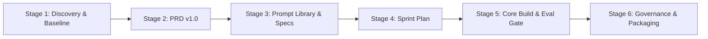

# CloudServe Intelligent Support System — Personal Learning & Stage-by-Stage Guide

Welcome to your personal stage-by-stage guide for the **CloudServe Intelligent Support System (FDE Capstone)**.

This folder is designed specifically for **you**: to explain not just *what* code or documents were generated, but **why** every decision was made, the business reasoning behind it, and how a Lead Forward Deployed AI Engineer thinks through real-world problems.

---

## 🗺️ The 6-Stage Master Journey

| Stage | Document / Folder | Focus | Status |
|---|---|---|---|
| **Stage 1** | [`stage_1_discovery_and_baseline.md`](stage_1_discovery_and_baseline.md) | Stakeholder interview analysis, 500 ticket audit, settling operational disagreements, and defining the core problem statement. | **Completed** ✅ |
| **Stage 2** | `stage_2_prd_specifications.md` | Translating discovery findings into Functional (`FR-01`..`12`) and Non-Functional (`NFR-01`..`06`) requirements with strict traceability. | *Up Next* ⏳ |
| **Stage 3** | `stage_3_prompt_library.md` | Designing production prompts as version-controlled engineering artifacts (`PR-01`..`06`) with temperature 0.0 determinism. | *Queued* |
| **Stage 4** | `stage_4_sprint_planning.md` | Backlog decomposition (`B-01`..`B-15`), dependency ordering, hourly budgets, and fallback definitions. | *Queued* |
| **Stage 5** | `stage_5_build_and_evaluation_gate.md` | Building ingestion, dense Chroma retrieval, calibrated classification, deterministic routing, guardrails, and passing **The Gate (A9)** unattended. | *Queued* |
| **Stage 6** | `stage_6_governance_and_delivery.md` | Fairness audit across language groups, kill switches, automated metrics reporting, effort logs, and video presentation. | *Queued* |

---

## 💡 The Core FDE Mindset: Why We Don't Build "Generic Chatbots"

Most AI projects fail because people jump straight into writing code or building an ungrounded chatbot. 

At CloudServe:
1. **The Client asked for a Chatbot**: Head of Support Marcus wanted a bot to "answer easy questions" and reduce backlog.
2. **The Discovery showed that would be Disastrous**:
   - 17.4% of tickets are legal, financial, or security redlines where a bot hallucinating could destroy the company.
   - Customers are technical software engineers who will screenshot incorrect answers and mock the platform publicly.
   - 71.4% of tickets are already answered in official docs, but agents and customers couldn't find them due to keyword search failure.
3. **The Real Engineering Solution**:
   - An **auditable, deterministic support pipeline** that uses dense vector search to retrieve authoritative documentation, auto-responds *only* when confidence is high and verifiable citations exist, and packages high-context dossiers for human engineers on escalations.

Read [`stage_1_discovery_and_baseline.md`](stage_1_discovery_and_baseline.md) to understand how we proved this with data!
