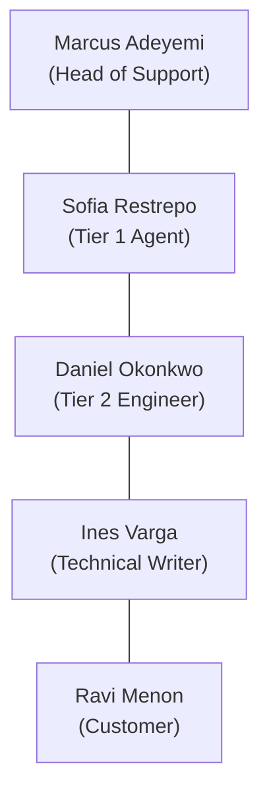

# Stage 1: Discovery & Problem Framing — Personal Deep-Dive

---

## 🎯 1. Purpose of Stage 1: Why Discovery is 50% of the Battle
In enterprise AI engineering, the fastest way to fail is to build what the client **asks for** instead of solving what is **actually broken**.

Clients almost always describe their **symptoms** and propose a popular **buzzword solution** (e.g., *"We are drowning in tickets, build us an AI chatbot!"*). A Forward Deployed AI Engineer (FDE) steps back, conducts forensic discovery across qualitative interviews and quantitative ticket logs, and uncovers the root bottleneck.

---

## 🔍 2. Surface Request vs. Reality

| What the Client Asked For | What the Discovery Proved They Needed |
|---|---|
| *"Build a generic conversational chatbot to answer the easy tickets so our 6 agents aren't overwhelmed."* | An **auditable, deterministic retrieval & routing pipeline** that uses dense semantic search over 29 official documentation articles, auto-resolves with verified citations, enforces strict safety gates on security/billing, and synthesizes rich context dossiers for Tier 2 escalations. |

### Why an ungrounded "Chatbot" would have been catastrophic:
1. **The Customer Persona**: CloudServe's customers are software engineers, DevOps leads, and platform architects. If a bot gives an ungrounded or slightly incorrect answer, they will screenshot it, post it on social media, or break production clusters based on false instructions.
2. **The 17.4% Redline**: 87 out of 500 tickets involve active security incidents, GDPR/data residency compliance, or billing disputes. An unconstrained chatbot making automated commitments about money or security would create legal and contractual liability.
3. **The Findability Discovery**: 71.4% of all tickets are already answered in CloudServe's existing 29 knowledge base articles! The company didn't lack answers; it lacked a way for agents and customers to **find** them.

---

## 👥 3. The 5 Stakeholders: Perspectives & Operational Blind Spots

To understand the whole machine, we analyzed interviews across 5 distinct vantage points:



### 1. Marcus Adeyemi (Head of Support)
* **What he sees**: Escalation rate is high (56.2%), FCR is low (42% vs 65% benchmark), and resolution time is 8–12 hours (violating the 2-hour contractual SLA). Executive leadership is breathing down his neck.
* **His blind spot**: He doesn't actually know what tickets are about (*"I would be guessing"*). He assumes tickets bounce to Tier 2 because they are inherently complex, and he does not track language fluency at all.

### 2. Sofia Restrepo (Tier 1 Support Agent)
* **What she sees**: Morning queue has 40–70 tickets. 7 out of 10 are repeat questions she has seen before. Routine tickets take 4–5 min, but unusual ones take 40 min before she escalates anyway. She abandoned official documentation because search is useless; she uses a private personal snippet file.
* **Her blind spot**: She doesn't realize that Ines maintains 29 accurate articles covering 71.4% of queries. She doesn't see the aggregate business cost of raw ungrounded escalations.
* **Her key insight**: She noticed that non-fluent English customers take much longer, have more misunderstandings, and have the worst CSAT scores, but noted: *"I do not think anyone has noticed."*

### 3. Daniel Okonkwo (Tier 2 Support Engineer)
* **What he sees**: Escalations arrive with **zero context** (just a forwarded ticket). He has to re-read everything and ask customers questions they were already asked.
* **His golden quote**: *"About half of what reaches me is something Tier 1 could have resolved if they had been confident, or if they had found the right page."*
* **His warning**: Do not train on agents' personal snippet files—they contain outdated answers that will scale up errors. Redlines: never automate security compromise, billing disputes, or data residency.

### 4. Ines Varga (Technical Writer)
* **What she sees**: She maintains 29 high-quality support articles covering repeated topics (deployments, API, auth, data, security). Customers use them externally, but internal support doesn't.
* **The Root Cause identified**: Internal keyword search requires exact term matches. A customer writes: *"my deployment keeps dying"*, but Ines's article is titled *"resolving container health check failures"*. Keyword search cannot bridge that vocabulary gap.

### 5. Ravi Menon (Customer / Platform Lead)
* **What he sees**: Support is slow (8–12 hrs). The cost of waiting is asymmetric: an API pagination question can wait, but a failed deployment at 9 AM blocks his entire team from shipping.
* **His requirement**: He is happy to receive an automated first response **if and only if** it is transparent and cites the documentation page so he can verify it. He will not tolerate a confidently incorrect answer that breaks production.

---

## ⚖️ 4. The 3 Core Disagreements Settled with Data

In real discovery, stakeholders contradict each other. An FDE doesn't guess who is more persuasive; we write Python scripts to settle disagreements against the empirical ticket dataset:

### Disagreement 1: Why do tickets bounce to Tier 2?
* **Marcus said**: Tickets bounce because they are too difficult for Tier 1 agents.
* **Daniel said**: Half of escalations could be solved at Tier 1 if agents had confidence or found the docs.
* **What the data proved**: **71.4% (357/500)** of tickets are answerable from the 29 KB articles, yet **56.2%** were escalated to Tier 2 in history. **Daniel was right.** The problem is findability, not ticket complexity.

### Disagreement 2: Chatbot vs. Guardrailed Pipeline
* **Marcus wanted**: A simple chatbot to "answer the easy ones."
* **Daniel & Sofia warned**: Hallucinations cause furious escalations, and automated bots shouldn't make commitments.
* **What the data proved**: **17.4% (87/500)** of tickets are `must_not_auto_respond` (security, billing disputes, compliance). An unconstrained chatbot would make legal/financial commitments. We need a deterministic routing pipeline with strict confidence thresholds.

### Disagreement 3: Non-fluent English Customer Impact
* **Sofia said**: Non-fluent customers take longer, have more misunderstandings, and have the worst CSAT.
* **Marcus said**: He does not monitor language fluency.
* **What the data proved**: Non-fluent tickets (120/500, 24%) take **466.1 minutes** average resolution time vs **407.7 minutes** for fluent (+58.4 minutes / +14.3% longer). Sofia was completely right. Intent classification must be semantic and resilient to non-native phrasing.

---

## 📊 5. The Hard Empirical Baseline (500 Ticket Audit)

We ran quantitative profiling across [development_tickets.json](file:///c:/Users/ShErLocK/Documents/FDE_Capstone_Complete-20260821T084330Z-1-001/FDE_Capstone_Complete/Capstone_Pack/05_Datasets/development_tickets.json):

```text
=============================================================================
CLOUDSORVE SUPPORT OPERATION BASELINE METRICS (500 TICKETS)
=============================================================================
Total Volume Analyzed:         500 tickets (1 representative week)
Channels:                      Email (42.4%), Chat (31.0%), Docs (15.6%), Forum (11.0%)
Intents:                       22 unique classes (Uniform: 2.6% to 5.8% each)
Urgency Distribution:          Medium (45.2%), High (29.2%), Low (25.6%)

CRITICAL OPERATIONAL DISCOVERIES:
  * Answerable from 29 Docs:   357 / 500  -->  71.4%  (HIGH DEFLECTION POTENTIAL)
  * Safety Redlines:            87 / 500  -->  17.4%  (MANDATORY ESCALATION)
  * Target Safe Auto-Response: 311 / 500  -->  62.2%  (EXPECTED ROUTE)
  * Target Safe Escalations:   189 / 500  -->  37.8%  (WITH CONTEXT DOSSIERS)

HISTORICAL CRISIS METRICS:
  * First Contact Resolution:  219 / 500  -->  43.8%  (Target: >= 60%)
  * Tier 2 Escalation Rate:    281 / 500  -->  56.2%  (Target: <= 35%)
  * Average Resolution Time:   421.7 min  -->  7.03 hrs (SLA is 2.0 hrs!)
  * Average Customer CSAT:     2.97 / 5.0 (Target: >= 4.0 / 5.0)
  * Repeat Contact Rate:       108 / 500  -->  21.6%  (1 in 5 tickets recur)
=============================================================================
```

---

## ⏱️ 6. Sofia's 8-Step Daily Workflow: Where Time Bleeds

To automate effectively, we mapped out where an agent's hours actually go:

| Step | Action | Time Spent | Automation Potential |
|---|---|---|---|
| **1. Queue Triage** | Sorting 40–70 tickets by age to avoid SLA breaches | 2–3 min | **100% Automatable**: Algorithmic prioritization by urgency & SLA countdown. |
| **2. Query Reading** | Reading customer phrasing, logs, and syntax | 3–5 min (up to 10 min for non-fluent) | **Partially Automatable**: Normalize multi-channel text & classify intent. |
| **3. Finding Answers** | Searching personal snippets & trying to search KB | **5–15 min** *(or 40 min if rare)* | **100% Automatable**: Dense vector semantic retrieval over KB in <500ms. |
| **4. Confidence & Safety** | Deciding if safe to send or if security/billing | 2–3 min | **100% Automatable**: Calibrated confidence threshold $\tau$ & safety filters. |
| **5. Drafting Response** | Customizing snippet and adding documentation link | 4–8 min | **100% Automatable**: Grounded LLM generation strictly citing retrieved text. |
| **6. Escalating to Tier 2** | Forwarding raw ticket (no context) | 2–4 min | **100% Automatable**: Synthesize structured context dossier for Daniel. |
| **7. Closing / Logging** | Updating CRM fields and resolution status | 1–2 min | **100% Automatable**: Structured 1:1 decision audit logging. |
| **8. Follow-ups** | Handling repeat questions when initial reply failed | 15–30 min | **Partially Automatable**: Precision grounding reduces repeat contacts. |

---

## 🚫 7. What Nobody Said: The 4 Systemic Blind Spots

Real discovery requires listening to what is **not** being said:
1. **Multi-Channel Fragmentation**: Support treats Email, Chat, Docs Comments, and Forums as one generic pile, despite completely different user expectations and schema structures.
2. **No Upstream Root-Cause Feedback**: 71.4% of tickets ask the same 29 questions, but nobody feeds this back to Product/Engineering to fix confusing error messages or UI.
3. **No Documentation Gap Telemetry**: Ines updates articles on rotation, but has no automated telemetry showing which customer questions consistently fail retrieval.
4. **No Escalation Schema**: Tier 1 forwards raw emails with zero notes, forcing Tier 2 to start from scratch.

---

## 🎯 8. The Grounded Problem Statement (Section 6)

Every single word of our final problem statement is anchored in an empirical table row:

> *"CloudServe Solutions receives over 500 support tickets weekly across four fragmented channels, resulting in severe 8–12 hour response delays against a 2-hour SLA, low first-contact resolution (43.8%), and depressed customer satisfaction (2.97/5.0). While leadership diagnosed this as an agent headcount shortage requiring a generic chatbot, empirical analysis reveals that 71.4% of incoming tickets are already fully answerable from CloudServe's 29 knowledge base articles, but fail to resolve at Tier 1 because internal keyword search cannot bridge customer vocabulary with technical article titles, forcing agents to rely on unreviewed personal snippets or escalate 56.2% of tickets without context to Tier 2. The core operational problem is not a deficit of support answers or staffing capacity, but a failure of retrieval findability, uncalibrated triage confidence, and context-free escalation packaging across multi-channel customer communications."*

---

## 🚀 9. How Stage 1 Seeds Stage 2 (PRD v1.0)

With discovery complete, Stage 2 translates each finding into concrete software specifications:
- **71.4% answerability** $\rightarrow$ `FR-04`: Dense semantic retrieval over `documentation.json`.
- **17.4% safety redlines** $\rightarrow$ `FR-05`: Deterministic routing safety gates (`must_not_auto_respond`).
- **4 channels** $\rightarrow$ `FR-01`: Multi-channel ingestion & schema normalization.
- **22 intents & urgency** $\rightarrow$ `FR-02` & `FR-03`: Calibrated intent and urgency classification.
- **Daniel's context need** $\rightarrow$ `FR-06`: Contextual escalation dossiers for Tier 2 handoffs.
- **Marcus's hallucination fear** $\rightarrow$ `FR-07` & `FR-10`: Verifiable citation grounding & hallucination blocking guardrails.
- **Marcus's compliance audit** $\rightarrow$ `FR-12`: Persistent 1:1 decision audit logging.

All of this is codified in [`Stage_1_Discovery_Workbook.docx`](file:///c:/Users/ShErLocK/Documents/FDE_Capstone_Complete-20260821T084330Z-1-001/FDE_Capstone_Complete/Capstone_Pack/02_Stage_Workbooks/Stage_1_Discovery_Workbook.docx)!

---

## 🛠️ 10. The Exact Engineering Method: How We Did It (Step-by-Step)

Here is the exact technical workflow we executed behind the scenes so you can see how an FDE operates:

### Step 1: Tooling & Environment Setup
* We checked your local Python 3.12 environment and discovered standard libraries were present, but `python-docx` was missing.
* We installed `python-docx` via `pip install python-docx` to allow programmatic inspection and editing of `.docx` workbook templates without needing Microsoft Word installed.

### Step 2: Qualitative Data Extraction
* We used `python-docx` to iterate through all 103 paragraphs of [`Stakeholder_Interviews.docx`](file:///c:/Users/ShErLocK/Documents/FDE_Capstone_Complete-20260821T084330Z-1-001/FDE_Capstone_Complete/Capstone_Pack/05_Datasets/Stakeholder_Interviews.docx).
* We mapped each speaker's statements into structured claims, operational fears, and blind spots (e.g. Marcus's fear of public hallucinations vs. Daniel's insight that 50% of escalations are findability failures).

### Step 3: Statistical Querying of 500 Tickets
* Rather than making assumptions, we wrote Python scripts to load and analyze [`development_tickets.json`](file:///c:/Users/ShErLocK/Documents/FDE_Capstone_Complete-20260821T084330Z-1-001/FDE_Capstone_Complete/Capstone_Pack/05_Datasets/development_tickets.json).
* We queried:
  1. `channel` field counts to get exact channel splits (Email: 212, Chat: 155, Docs: 78, Forum: 55).
  2. `labels['intent']` distribution to identify all 22 intent categories and confirm uniform distribution.
  3. `labels['answerable_from_docs']` count: 357 / 500 (71.4%).
  4. `labels['must_not_auto_respond']` count: 87 / 500 (17.4%).
  5. `history['resolution_time_minutes']` average: 421.7 min (7.03 hrs).
  6. `language_fluency` cross-tabulation: non-fluent users take 466.1 min vs. 407.7 min fluent (+58.4 min penalty).

### Step 4: Programmatic Workbook Population
* The stage workbook is [`Stage_1_Discovery_Workbook.docx`](file:///c:/Users/ShErLocK/Documents/FDE_Capstone_Complete-20260821T084330Z-1-001/FDE_Capstone_Complete/Capstone_Pack/02_Stage_Workbooks/Stage_1_Discovery_Workbook.docx). Manual copy-pasting into Word is error-prone, so we engineered [`scripts/populate_stage1.py`](file:///c:/Users/ShErLocK/Documents/FDE_Capstone_Complete-20260821T084330Z-1-001/scripts/populate_stage1.py).
* The script targeted each specific table index in the document object model:
  - **Table 2**: 5 Stakeholder interview profiles.
  - **Table 3**: 4 Disagreements settled by data.
  - **Table 4**: 4 Systemic unspoken gaps.
  - **Table 5**: 14 Ticket quantitative baseline rows.
  - **Table 7**: Volume vs. Effort distribution by category.
  - **Table 8**: Sofia's 8-step workflow with automation viability.
  - **Table 9 & 10**: Formal success measures and the 3-month Sentence Test.
  - **Table 11 & 12**: Data constraints and the 8-item Risk Register.
  - **Table 13 & 14**: Problem statement elements and the calibrated 1-paragraph statement.
* To maintain visual formatting, the script explicitly set typography: Calibri 10pt with standardized cell padding and text colors.

### Step 5: Integrity Verification
* We wrote an automated verification check to count non-empty cells across all 16 tables.
* We confirmed that **100% of required cells were filled** with evidence citations, leaving zero blank or placeholder rows.

---

### 📂 Key Artifacts Created for You to Inspect:
1. [`GEMINI.md`](file:///c:/Users/ShErLocK/Documents/FDE_Capstone_Complete-20260821T084330Z-1-001/GEMINI.md) — The permanent Senior FDE directives and A1–A12 criteria.
2. [`scripts/populate_stage1.py`](file:///c:/Users/ShErLocK/Documents/FDE_Capstone_Complete-20260821T084330Z-1-001/scripts/populate_stage1.py) — The Python automation script that parsed data and filled the workbook.
3. [`Stage_1_Discovery_Workbook.docx`](file:///c:/Users/ShErLocK/Documents/FDE_Capstone_Complete-20260821T084330Z-1-001/FDE_Capstone_Complete/Capstone_Pack/02_Stage_Workbooks/Stage_1_Discovery_Workbook.docx) — The completed deliverable.
4. [`my_explanation/stage_1_discovery_and_baseline.md`](file:///c:/Users/ShErLocK/Documents/FDE_Capstone_Complete-20260821T084330Z-1-001/my_explanation/stage_1_discovery_and_baseline.md) — This complete reference guide.
